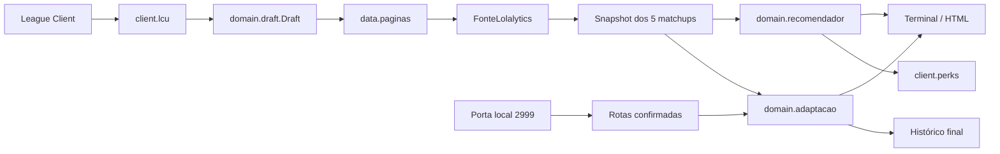

# Guia do projeto

Este arquivo descreve a arquitetura, o vocabulário e as regras de manutenção do
LoL Draft Advisor. Para usar o programa, comece pelo [README](../README.md).

## Em 30 segundos

O advisor lê o champ select, busca a página base e os cinco matchups no
Lolalytics, combina as evidências e produz uma recomendação de runas, feitiços e
itens. Runas e feitiços podem ser aplicados automaticamente no League Client.

O sistema trabalha em duas fases:

| Fase | Rotas usadas | Resultado |
|---|---|---|
| Champ select | Inferidas temporariamente | Runas, feitiços e prévia de itens |
| Tela de carregamento | Confirmadas pela porta local 2999 | Sequência final de itens e histórico |

A inferência de rota não entra no cálculo dos itens. Assim, um flex pick
interpretado de forma errada não contamina a build inteira. Runas e feitiços
continuam sendo decididos e aplicados durante o draft.

## Fluxo



1. `client.lcu` lê campeão, rota e inimigos.
2. `data.paginas` infere o oponente antes da busca, calcula a relevância e
   materializa as cinco páginas `/vs/` uma única vez.
3. `domain.recomendador` compara escolhas dentro de cada matchup e combina os
   deltas por amostra, variância e relevância.
4. `fluxos.execucao` cria um snapshot; a apresentação mostra o mesmo objeto e
   `client.perks` faz as escritas autorizadas.
5. `fluxos.vigia` espera as rotas confirmadas e recalcula somente a sequência de
   itens.

O motor de itens, em `domain.adaptacao`, parte da build popular e compara
mudanças de frequência no recorte Emerald+. Ele não usa win rate de item como
evidência causal. Se a amostra não sustenta uma adaptação, devolve a build
popular em vez de deixar a recomendação vazia.

## Fronteiras dos pacotes

| Pacote | Responsabilidade | Não deve fazer |
|---|---|---|
| `advisor.client` | Ler o LCU e a porta local 2999; aplicar runas e feitiços em `perks` | Decidir recomendações |
| `advisor.data` | Buscar, cachear, parsear e normalizar fontes externas | Escolher a build |
| `advisor.domain` | Modelar draft, estatística, comparar dados e recomendar | Fazer HTTP, imprimir ou escrever no client |
| `advisor.fluxos` | Orquestrar coleta, vigia, aplicação e investigação | Duplicar a estatística do domínio |
| `advisor.apresentacao` | Formatar terminal e HTML | Recalcular decisões |
| `advisor.observabilidade` | Registrar diagnóstico e histórico final | Alterar recomendações |

O seam de dados é `fluxos.fontes.FonteDeDados`. O adapter real é
`data.fonte_lolalytics`; os testes usam uma fonte em memória. O domínio recebe
modelos neutros de `domain.modelos` e não importa o parser externo.

## Regras de manutenção

- `config.toml` é a fonte de verdade para preferências e cortes.
- A relevância usa proximidade de rota. Não há bônus manual por ameaça, porque a
  página `/vs/` já é condicionada ao inimigo.
- A comparação é pareada dentro de cada matchup, nunca contra uma média global.
- A build base é o ponto de partida. Uma troca precisa superar os cortes de
  amostra e confiança configurados.
- Itens entram na sequência. O item deslocado desce; não desaparece.
- Botas competem apenas com botas. Bottom recebe seis itens mais botas; o item 6
  usa a distribuição do item 5 como proxy, pois a fonte não publica esse slot.
- Runas e feitiços podem usar win rate, pois são escolhidos antes da partida.
  Itens exigem cautela por causalidade reversa e viés de sobrevivência.
- `vslane` é a rota do inimigo, não a sua.
- A apresentação nunca consulta a rede nem recalcula a recomendação.
- Toda escrita no League Client fica em `client/perks.py`.
- `domain.estatistica` é a única fronteira com SciPy, NumPy e statsmodels.
  `comparacoes`, `analise`, `transferencias` e `adaptacao` usam seus contratos;
  o recomendador não deve importar bibliotecas estatísticas diretamente.

## Vocabulário essencial

**Draft:** seu campeão, sua rota, os cinco inimigos e, quando conhecido, o
oponente direto.

**Oponente direto:** inimigo que divide sua rota.

**Rotas inferidas:** hipóteses usadas somente no draft para terminar runas e
feitiços.

**Rotas confirmadas:** funções devolvidas pela porta 2999; única origem aceita
para a sequência final.

**Matchup:** partidas contra um inimigo específico, ele jogando na rota dele.

**Páginas do draft:** os cinco matchups com a relevância já resolvida.

**Relevância:** quanto um inimigo pesa pela proximidade de rota, nunca pelo
tamanho da amostra.

**Comparação pareada:** comparar candidato e escolha de referência dentro do
mesmo matchup para remover o efeito do confronto.

**Build base:** escolhas mais populares usadas como ponto de partida.

**Troca:** inserir uma alternativa que venceu a comparação; o ocupante desce.

**Antecipação:** adiantar um item que já estava na sequência; nada é removido.

**Recomendação final da partida:** runas e feitiços decididos no draft mais a
sequência recalculada com rotas confirmadas.

## Onde alterar cada comportamento

| Quero mudar… | Arquivo principal |
|---|---|
| Pesos, elo, janela e cortes | `config.toml` |
| Classificações visuais | `advisor/domain/regras.py` |
| Fórmula pareada | `advisor/domain/comparacoes.py` |
| Motor principal e sequência | `advisor/domain/recomendador.py` |
| Adaptação de itens por pick rate | `advisor/domain/adaptacao.py` |
| Inferência antes da busca | `advisor/data/paginas.py` |
| Parser do Lolalytics | `advisor/data/lolalytics.py` e `qwik.py` |
| Cache e adapter da fonte | `advisor/data/cache.py` e `fonte_lolalytics.py` |
| Leitura do champ select | `advisor/client/lcu.py` |
| Aplicação de runas e feitiços | `advisor/client/perks.py` |
| Ciclo do champ select | `advisor/fluxos/vigia.py` |
| Coleta e aplicação de snapshot | `advisor/fluxos/execucao.py` |
| Terminal e relatório local | `advisor/apresentacao/` |

## Dados, cache e histórico

- Cache de rede: `%LOCALAPPDATA%\LoLDraftAdvisor\cache`.
- Cache normalizado da página base: `%LOCALAPPDATA%\LoLDraftAdvisor\cache\builds`.
- Diagnóstico técnico: `logs/advisor.log`.
- Histórico: `logs/recomendacoes.jsonl`, somente quando a partida entra em
  `InProgress`; dodges e estados intermediários não entram.
- Relatórios locais: `relatorios/`.

Uma resposta incompleta nunca substitui o cache. Quando o fallback é usado, o
terminal preserva a data e o patch reais.

## Testes

```powershell
.\.venv\Scripts\python.exe -m pytest -q
```

Os testes de fluxo usam fontes falsas; os testes do LCU usam sessões em memória
e não exigem o client aberto.

## Pendências e experimentos

### Agrupar matchups por característica

Pendência principal: testar grupos como cura, CC pesado e dano mágico, em vez de
testar dezenas de itens para cada composição. Isso reduz comparações múltiplas e
aumenta a amostra de cada hipótese. A análise atual não encontrou efeito de
composição replicável depois da correção de pesos, centralização e FDR.

### Interface de terminal

Quando a quantidade de opções justificar, agrupar a ajuda por modo, dados,
exibição e aplicação. Preferências permanentes continuam no `config.toml`; flags
temporárias continuam disponíveis para experimentos.

## Documentos auxiliares

`CLAUDE.md` e `AGENTS.md` são instruções para as ferramentas de desenvolvimento,
não documentação do produto.

